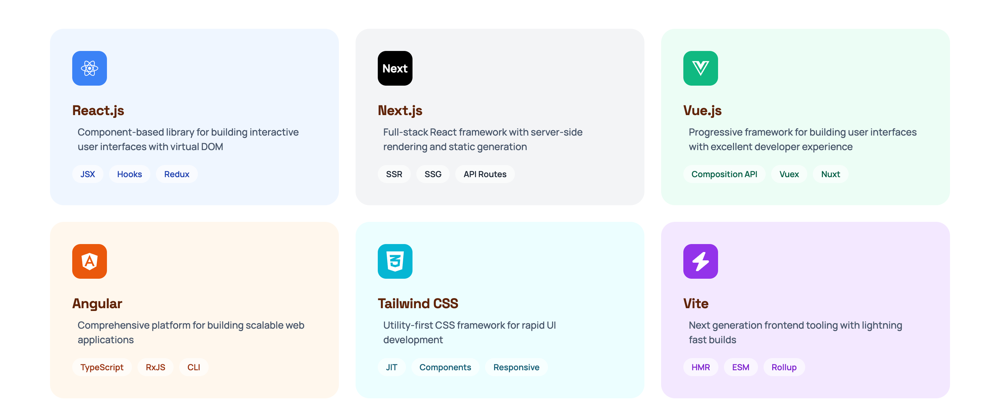
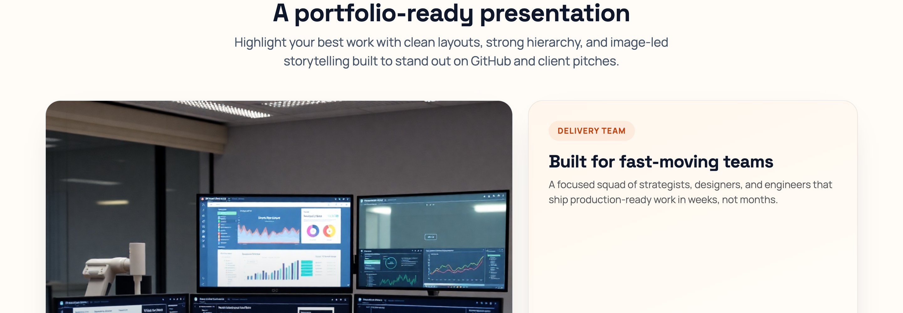
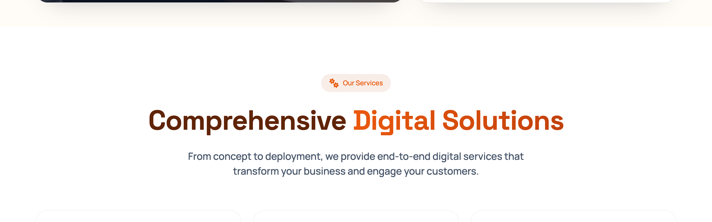
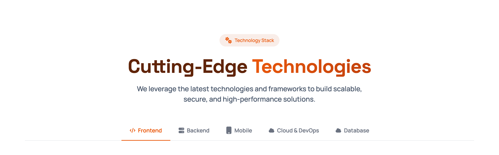
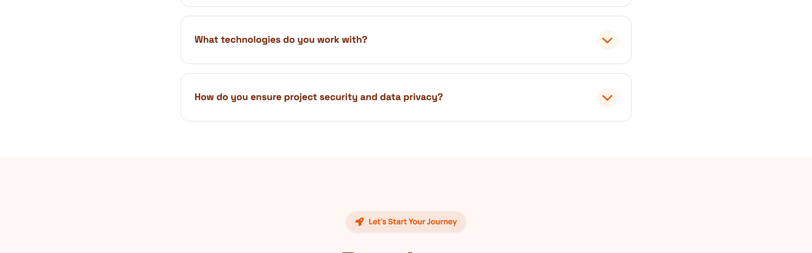

# Clarity - Digital Solutions Landing Page

A premium, responsive landing page for a digital solutions company. The project focuses on clean structure, strong visual hierarchy, and accessible markup, making it ready for a professional GitHub portfolio or client presentation.

## Preview







## Features
- Showcase-ready layout with image-led storytelling
- Responsive UI built on Bootstrap 5
- Mega-menu navigation and clear section hierarchy
- Hero, showcase, services, technology tabs, testimonials, FAQ, and contact sections
- Refined typography, gradients, and soft motion
- Accessible navigation with keyboard-friendly skip link

## Tech Stack
- HTML5
- CSS3
- Bootstrap 5
- Vanilla JavaScript (minimal enhancements)

## Project Structure
```
.
├── css/
│   ├── bootstrap.min.css
│   └── style.css
├── images/
│   ├── crops/
│   ├── avatar-*.jpg
│   ├── hero-img.png
│   └── site-preview.png
├── js/
│   ├── bootstrap.bundle.min.js
│   └── main.js
├── index.html
└── README.md
```

## Getting Started
Open `index.html` in your browser. No build step is required.

## Notes
- Icons are inline SVGs for performance and styling flexibility.
- The project is intentionally framework-free to keep it lightweight and easy to understand.

## License
This project is available for personal portfolio use.
